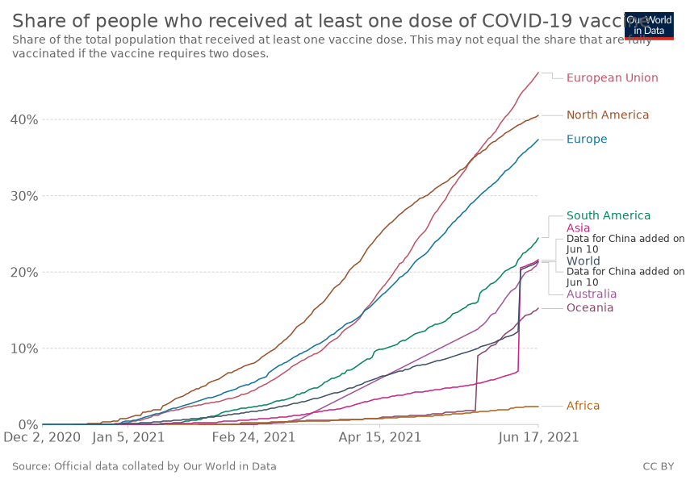

Show Your Stripes Day
#####################

:author: Ashwin Vishnu Mohanan
:date: 2021-06-18T16:06:06.997080
:slug: show-your-stripes-day
:status: draft
:summary: It is hot everywhere. An info-graphic, a stark reminder that the worst is not over yet.
:category: Blog
:tags: life, climate, covid-19

The end of the COVID-19 pandemic is near as vaccinations progress in most
places across the world, slowly but surely,

   Source: Our world in data

You and I must be looking forward to a return to normality and a happy ending
as all children's books end. However as all stories go, this is anything but
the end. Humanity has been thrust into a series of struggles in this modern
age. As I like to remind myself, it is humanity that needs saving --- not life.
Life always finds a way. We have to ensure that we are not the architects of
our own doom.

Now we face the elephant in the room: the climate emergency, global heating
(erstwhile, global warming) is still on. It did not take a break during the
pandemic as most of us stopped commuting, travelling long distances and sat
home for several months at a stretch. Why? It's because the energy production
and the economy continued to function as it has always been. A system with
little incentive to reduce emissions without sweeping tax reforms and
regulations to level the playing field.

I take that you are aware of all of this. I take a moment to look at all the
places I have lived. The data is clear. It is hot everywhere.

.. raw:: html

   <video controls width="100%">

       <source src="/media/videos/stripes.mp4"
               type="video/mp4">

       Sorry, your browser doesn't support embedded videos.
   </video>

